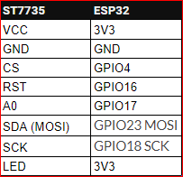

# ESP32-WiFi-Scanner

A scanner for Wi-Fi networks that is specifically designed for **ESP32** controllers.
The list of Wi-Fi networks can be seen on the **Serial** and 128x160 **ST7735** displays simultaneously.
Information received about networks includes **SSID**, **BSSID**, **RSSI**, and **Chanel**.
The list of received Wi-Fi networks can also be used for other functions.

## Connect the ST7735 display to NodeMCU32:

> **Contact Me: johntitorqwqqwqqwq@yahoo.com**
